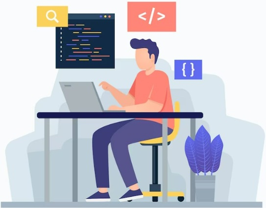

# Yossi Karasik - Developer Portfolio

This is the source code for my personal developer portfolio. I built this site from scratch to showcase my projects, tech stack, and background as a Full-Stack Developer.



## Tech Stack

- **React 18** (Bootstrapped with Vite)
- **Vanilla CSS** (Custom properties, Flexbox/Grid, zero external UI frameworks)
- **Framer Motion** (For lightweight scroll and component animations)

## Notable Details

Instead of relying on heavy external libraries, I focused on building custom solutions for the UI:
- **Custom Swiper:** Built a horizontal carousel for the education section using native CSS `scroll-snap` and React refs for navigation dots.
- **Infinite Marquee:** A CSS-only infinite scrolling animation for the tech stack display.
- **Fully Responsive:** Fluid layouts that adapt to any screen size using standard media queries.

## Running Locally

To get this project up and running on your local machine:

1. Clone the repository:
   ```bash
git clone https://github.com/yosikari/dev-portfolio.git
````

2.  Navigate into the directory and install dependencies:

    ```bash
    cd dev-portfolio
    npm install
    ```

3.  Setup environment variables (if needed for the contact form):
    Create a `.env` file in the root directory.

    ```env
    VITE_APP_YOUR_KEY=value
    ```

4.  Start the development server:

    ```bash
    npm run dev
    ```

## Links

  - [LinkedIn](https://www.linkedin.com/in/yosikari)
  - [GitHub](https://github.com/yosikari)

<!-- end list -->
